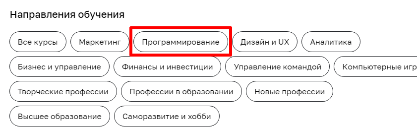
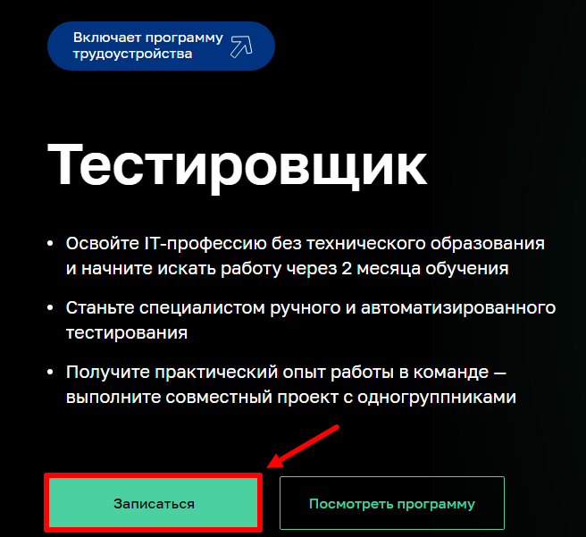
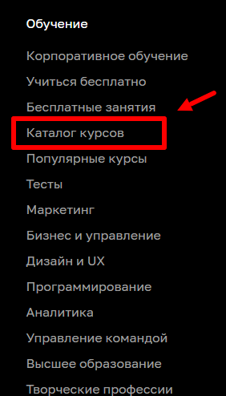
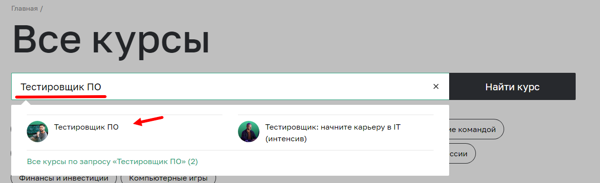
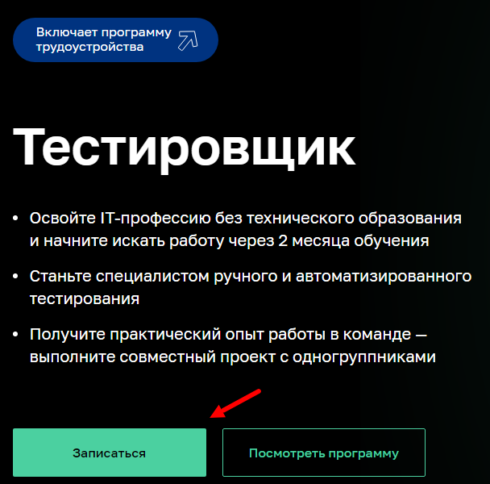
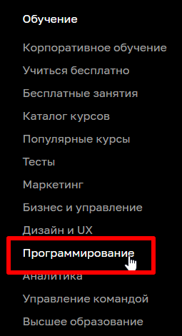
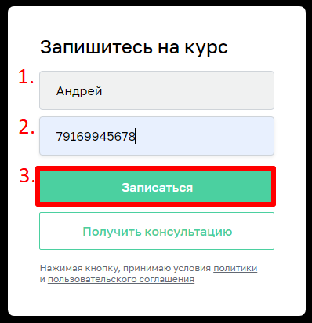
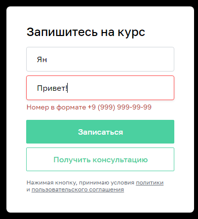

# Тестирование возможности записаться на обучение профессии «Тестировщик ПО»
## План автоматизации тестирования сценария перехода к форме записи и заполнения этой формы:
1. Перечень автоматизируемых сценариев
2. Перечень используемых инструментов с обоснованием выбора
3. Перечень необходимых разрешений, данных и доступов
4. Перечень и описание возможных рисков при автоматизации
5. Перечень необходимых специалистов для автоматизации
6. Интервальная оценка с учётом рисков в часах

### Перечень автоматизируемых сценариев
* **Переход к форме записи на курс:**
#### Сценарий №1
1. На главной странице [Нетологии](https://netology.ru/) нажать на кнопку "Каталог курсов" 

2. В открывшемся списке "Направления обучения" выбрать "Программирование" 

3. На странице подраздела [Программирование](https://netology.ru/development) выбрать профессию "Тестировщик ПО"

4. На [странице](https://netology.ru/programs/qa) с описанием профессии кликнуть по кнопке "Записаться" 

#### Сценарий №2
1. Главную страницу [Нетологии](https://netology.ru/) пролистать до раздела "Направления обучения" и нажать на подраздел "Программирование"

2. Повторить шаги 3 и 4 из **сценария №1**

#### Сценарий №3
1. Главную страницу [Нетологии](https://netology.ru/) пролистать до футера страницы и в колонке "Обучение" кликнуть на "Каталог курсов"

2. На странице [навигации](https://netology.ru/navigation) в разделе "Все курсы" выбрать курс "Программирование"

3. Повторить шаги 3 и 4 из **сценария №1**

#### Сценарий №4
1. Повторить шаг 1 из **сценария №3**
2. На странице [навигации](https://netology.ru/navigation) в разделе "Все курсы" в поисковой строке ввести "Тестировщик ПО"

3. Кликнуть по профессии "Тестировщик ПО" в ниспадающем списке
4. На открывшейся [странице](https://netology.ru/programs/qa?recommended_by=instant_search#/) кликнуть по кнопке "Записаться"

#### Сценарий №5
1. Главную страницу [Нетологии](https://netology.ru/) пролистать до футера страницы и в колонке "Обучение" кликнуть на курс "Программирование"

2. Повторить шаги 3 и 4 из **сценария №1**

* **Заполнение формы записи на курс:**

*Позитивный сценарий:*

1. В [форме](https://netology.ru/programs/qa#/order) записи на курс заполнить поля "Имя" и "Телефон" валидными данными и нажать кнопку "Записаться"

*Ожидаемый результат:* 
Выведено сообщение на экран с текстом: "Поздравляем! Вы успешно записаны на курс "Тестировщик ПО". Наш специалист свяжется с Вами в ближайшее время для дальнейших инструкций."

*Негативный сценарий №1*
1. В [форме](https://netology.ru/programs/qa#/order) записи на курс в поле "Имя" ввести цифры и символ, в поле "Телефон" ввести валидный номер телефона 

*Пример невалидных данных:*
64156! / +7 (901) 234-56-78

*Ожидаемый результат:*
Поле "Имя" подсвечено красным с сообщением "Должно состоять из букв"

*Негативный сценарий №2*
1. В [форме](https://netology.ru/programs/qa#/order) записи на курс в поле "Имя" ввести валидное имя, в поле "Телефон" ввести текст и символ

*Пример невалидных данных:* 
Ян / Привет!

### Перечень используемых инструментов с обоснованием выбора
- [**IntelliJ IDEA**](https://www.jetbrains.com/ru-ru/idea/) - профессиональная среда разработки
- Язык программирования **Java** - мощный, высокоуровневый язык программирования, который имеет ряд *преимуществ:*
1. платформонезависимость
2. безопасность
3. масштабируемость
4. большая экосистема, включающая множество библиотек и инструментов
- Проект на базе **Gradle** - более лаконично можно прописать все плагины и зависимости, нежели в **Maven**
- Файл **.gitignore** - чтобы не засорять наш проект ненужными папками и файлами
- [**Lombok**](https://projectlombok.org/) - для автогенерации полей и методов
- Паттерн **Page Object** - для разделения логики написания тестируемых алгоритмов
- Фреймворк [**Selenide**](https://ru.selenide.org/) - *преимущества:*
1. изящный API
2. стабильные тесты
3. мощные селекторы
4. простая конфигурация
- **DevTools** - для работы с [веб-сайтом Нетологии](https://netology.ru/) и поиска селекторов
- [**AppVeyor**](https://www.appveyor.com/) или [**GitHub Actions**](https://github.com/features/actions) как система **CI** для того, чтобы избежать конфликтов кода и увеличить качество и стабильность продукта
- Автотесты на [**Junit 5**](https://junit.org/junit5/) - популярный фреймворк для написания юнит-тестов на **Java**, который имеет ряд *преимуществ:*
1. простой интерфейс
2. модульный подход к тестированию
3. поддержка различных видов тестов
4. поддержка многоязычности
- [**Git**](https://git-scm.com/) - как система контроля версий, либо можно использовать интерфейс IDEA для отправки проекта на [GitHub](https://github.com/)
- [**GitHub**](https://github.com/) - платформа для совместной разработки, *преимущества:*
1. публичные репозитории, комментарии и ветвление 
2. хранение истории изменений, возможность вернуться к любой предыдущей версии проекта
3. интеграция с другими инструментами, такими как баг-трекеры, системы контроля версий и другие средства разработки.
### Перечень необходимых разрешений, данных и доступов
- Разрешение на автоматизированное тестирование сайта [Нетологии](https://netology.ru/)
- Перечень тестовых данных: имена, телефоны (для позитивных сценариев)
- Требования к тестовым данным:
1. **Имя** должно состоять из букв и должно быть не короче 2 символов
2. **Номер телефона** в формате +7 (999) 999-99-99

*Пример валидных данных:* 
Андрей / +7 (916) 994-56-78

- Доступы к базе данных и API [сайта](https://netology.ru/) Нетологии
### Перечень и описание возможных рисков при автоматизации
- Трудности при поиске локаторов элементов на страницах, возможно, что не все имеют явные привязки.
В ходе выполнения проекта может измениться структура сайта и локаторы придётся уточнять.

- Увеличение накладных расходов на автоматизацию (возможно данную функциональность дешевле протестировать руками)

- Потеря рабочих мест: автоматизация может привести к снижению потребности в ручной работе, что может привести к увольнению сотрудников

- Ошибки в коде: некачественный код или неправильные алгоритмы могут привести к ошибкам в автоматизированных процессах

- Ограниченная гибкость: автоматизированные тесты могут быть ограничены в их возможностях и не могут адаптироваться к изменениям в условиях работы

- Риски безопасности: автоматизация может подвергаться киберугрозам или взломам, что может повлечь за собой потерю конфиденциальных данных или другую вредоносную деятельность

- Риски производительности: автоматизированные тесты могут занимать много времени на выполнение
### Перечень необходимых специалистов для автоматизации
- AQA Engineer
### Интервальная оценка с учётом рисков в часах
40 - 60 часов
